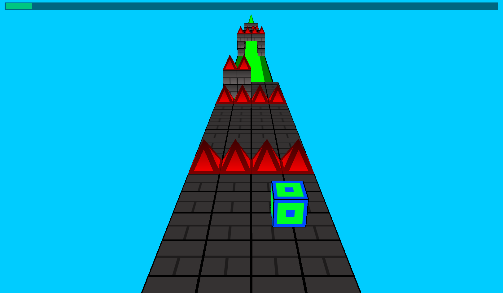
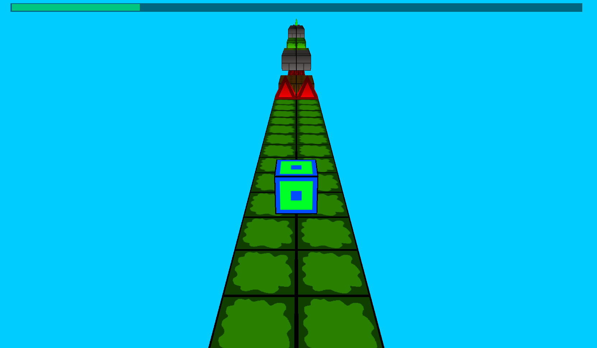
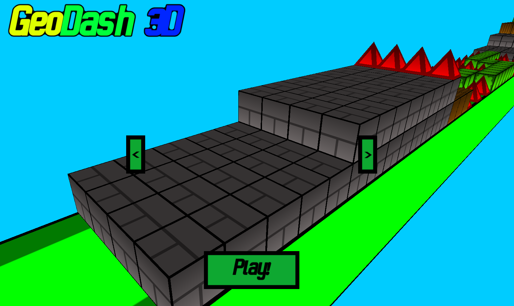

# Geodash-3D

## About
This is a game somewhat inspired by the popular mobile game "Geometry Dash". 

I wanted to create this game as a way to test my knowledge with OpenGL so far (so far I have learned how to use textures and multiple models in OpenGL).

## Compile the project
**DEPENDENCIES:** [glfw](https://github.com/glfw/glfw), [SOIL2](https://github.com/SpartanJ/SOIL2), [glad](https://glad.dav1d.de/), [glm](https://github.com/g-truc/glm), [openal-soft](https://github.com/kcat/openal-soft), [libsndfile](https://github.com/libsndfile/libsndfile)

```
git clone --recursive https://github.com/JLi69/geodash3
```

To compile the project just run the following commands:

**Linux**:

```
cmake -S geodash3 -B geodash3/build
cd geodash3/build
make
```

**Windows**:

```
cmake -S geodash3 -B geodash3/build
cd geodash3/build
mingw32-make
```

I compiled the game using [mingw-w64](https://github.com/mingw-w64/mingw-w64) for Windows though you might be able to compile it using some other compiler if you do some configuring around though I haven't bothered to try that out.

**MacOS**:

I didn't really take MacOS into account when designing the game and I'm a bit too lazy to figure it out as I don't own a MacBook but it shouldn't be too hard to figure out so if you implement a way to compile it on Mac, then please make a pull request. 

After that, merely run the command `./geodash3` to run the executable and play the game!

## Gameplay
### Controls
 - A/D to move left and right respectively
 - SPACE to jump

You can jump on top of solid blocks to make your way across the level. There are bouncy blocks that can allow you to jump higher. However, you can only jump on top of the blocks as if you hit the block from the front or side you will die and have to restart the level. If you jump onto the spikes (the pyramids), you will die and have to restart the level (so avoid jumping onto them as I'm fairly certain that death is a bad thing). Once you have cleared the entire level, the next level will load and you can continue doing this until the last level and once you beat the final level, you will have won the game.

## Importing a level
If you want to import a custom level, create a .lvl file with the [level editor](https://github.com/JLi69/geodash3-editor). Then take the level (found in the `saves` folder in the directory containing the level editor executable) and paste it into the `res/levels` folder in the directory containing the game executable. Then edit `level-list.txt` and add the name of the level file and open the game. You should hopefully be able to play your custom level! 

## Screenshots






## License
Source Code (includes shaders): GPLv2 or at your choice, any later version. (The code is a tangle of spaghetti but if you do decide to mod the game, I would love to try it out and see what additions/modifications were made)

Assets: Public Domain (CC0)
Use the art for whatever purpose you want to (my art isn't very good but you might find some use for it). The sound effects were randomly generated with [sfxr](https://www.drpetter.se/project_sfxr.html). 

## Other
I don't intend to continue with this project as I've currently lost a decent bit of motivation so feel free to fork this and mod the game to whatever you want it to be. However, if you want to add some features (such as music, sound effects, art, or some other features) feel free to make a pull request.

## Credits
Programming: JLi69 AKA NotJL AKA Nullptr Error

Suggestions: Thornion, FUNDUDZ!
